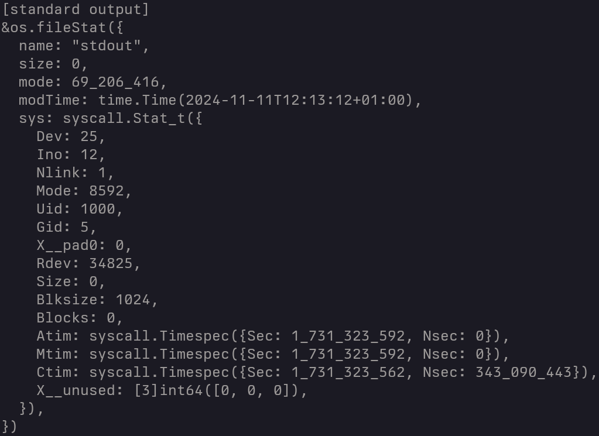

# go-pp
## Introduction
The go-pp library —"pp" being for "pretty printer"— contains utilities to pretty
print Go values. Its main use case is to help debugging. The `%#v` standard
formatting sequence is fundamentally user hostile: no indentation, prints
pointers instead of recursing, expands values that should not be expanded (e.g.
`time.Time` values).

The printing algorithm tries its best to present values in a useful way. Types
are printed when it makes sense, simple values are displayed inline when
possible, various standard types have a custom representation.

Example:
```go
info, _ := os.Stat("/dev/stdout")
p.Print(info, "stdout info")
```


Debugging is hard. The `pp` package makes it easier.

## Usage
### Printing values
Import `go.n16f.net/pp` and call `pp.Print` with any value as argument. Extra
arguments are used as a format string and arguments to add a label to the
output.

For example:
```go
pp.Print(os.Getenv("HOME"), "home directory")
```
```
[command line arguments] []string(["./test"])
```

### Configuring printers
Printers can be configured with various settings to match your preferences. The
following options are available:

- `(*Printer).SetDefaultOutput`: set the output (`io.Writer`) used by the
  printer for the `Print` method (default: `os.Stdout`).
- `(*Printer).SetFormatValueFunc`: set the function used to override value
  formatting. See the section about custom formatting below for more
  information (default: `pp.FormatValue`)
- `(*Printer).SetMaxInlineColumn`: set the column beyond which the printer will
  revert to the normal output format when trying to print a value inline
  (default: 80).
- `(*Printer).SetIndent`: set the string used for each indentation level
  (default: `"  "`).
- `(*Printer).SetLinePrefix`: set a string to be printed at the beginning of
  each output line.
- `(*Printer).SetPrintTypes`: control type printing. Can be either:
  - `pp.PrintTypesDefault`: print the type of values when it is not obvious;
  - `pp.PrintTypesAlways`: print the type of all values;
  - `pp.PrintTypesNever`: never print any type.
- `(*Printer).SetHidePrivateFields`: hide private (non-exported) fields when
  printing structures.
- `(*Printer).SetThousandsSeparator`: set the character (rune) used between
  groups of three digits when printing numbers (default: `'_'`).

You can either modify the default printer used by `pp.Print`
(`pp.DefaultPrinter`) or create your own printer.

See the [`custom-printer` program](examples/custom-printer/main.go) for an
example.

Printers are thread safe.

### Custom formatting
It is possible to control the representation of specific types. Use
`(*Printer).SetFormatValueFunc` to pass your own function.

The function accept a `reflect.Value` argument and can return an `any` value
which can be either:

- `nil` to use the default printer representation;
- a value of type `RawString` to print the value as a string without any further
  formatting (e.g. `RawString("foo")`  will simply print `foo`);
- any other value to be formatted by the printer.

Note that the printer will only call this function on values, not pointers.

The default function, `pp.FormatValue` handles various standard types such as
`time.Time` or `regexp.Regexp`.

See the [`custom-formatting` program](examples/custom-formatting/main.go) for an
example.

### Documentation
Refer to the [Go package documentation](https://pkg.go.dev/go.n16f.net/pp)
for information about the API.

# Licensing
Go-pp is open source software distributed under the
[ISC](https://opensource.org/licenses/ISC) license.

